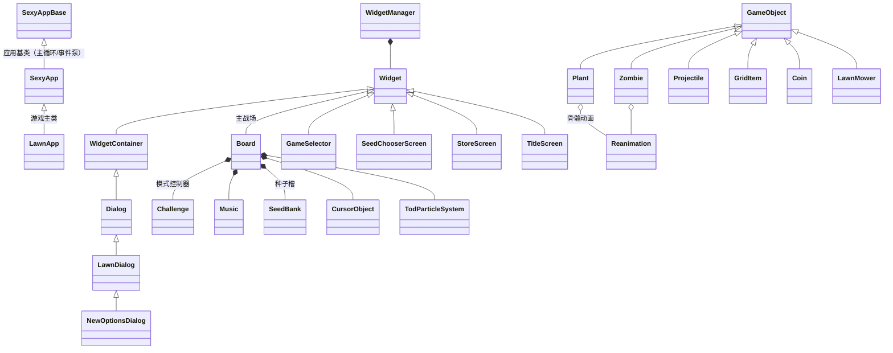

# 架构总览

> 本文件回答三个问题：**代码分几层、程序怎么跑起来、数据怎么流动**。各模块的类/函数/变量细节见编号模块文档。

---

## 1. 六层架构

依赖方向自上而下（上层调用下层，下层不依赖上层）：

```
┌───────────────────────────────────────────────────────────────┐
│ ① 游戏逻辑层  src/Lawn          LawnApp → Board → 实体/界面/系统 │
│   植物/僵尸/投射物/网格物品/割草机/金币  挑战模式  存档 音乐 商店 │
├───────────────────────────────────────────────────────────────┤
│ ② 引擎框架层  src/SexyAppFramework（PopCap SexyApp 引擎）        │
│   应用基类/控件树/画布/图像/设备接口/资源管理/声音/解析器/工具    │
├───────────────────────────────────────────────────────────────┤
│ ③ 通用游戏库  src/TodLib        骨骼动画/粒子/特效/资源定义/工具  │
├───────────────────────────────────────────────────────────────┤
│ ④ I/O 与解码  src/PakLib（pak 包）+ src/ImageLib（图像解码）     │
│               jpeg/jpeg2000/png/zlib/ogg 第三方编解码            │
├───────────────────────────────────────────────────────────────┤
│ ⑤ 平台/图形   DirectX8 / DirectSound / BASS / FMOD / Win32     │
│               （dx8sdk 头文件；音频后端动态加载）                 │
├───────────────────────────────────────────────────────────────┤
│ ⑥ 游戏资源（运行时数据，不随源码分发）                            │
│   main.pak（图像/声音/动画）  properties/*.xml（资源描述）        │
└───────────────────────────────────────────────────────────────┘
```

关键点：
- **编译归属**：①③ 编译进 `Lawn` exe；②④ 编译进 `SexyAppBase` 静态库；
- ① 与 ② 之间通过 `SexyApp` 派生 + `Widget` 派生两条继承线耦合，通过 `gSexyAppBase/gLawnApp` 全局单例互相引用。

---

## 2. 类继承体系



### 继承线说明

| 线 | 基类 | 说明 |
|---|---|---|
| **界面线** | `Sexy::Widget` | 一切可见可交互的控件：`Board` 是特殊 Widget，各屏幕（GameSelector 等）是 Widget，对话框是 `Dialog`（WidgetContainer 派生）。`WidgetManager` 持有控件树并负责事件分发/Z 序。 |
| **实体线** | `GameObject` | 战场上的动态对象统一基类：位置(`mX/mY`)/行(`mRow`)/渲染层(`mRenderOrder`) + 画布平移的 BeginDraw/EndDraw。派生：Plant/Zombie/Projectile/GridItem/Coin/LawnMower。 |
| **应用线** | `Sexy::SexyAppBase` | 主循环、消息泵、时钟、加载线程、屏幕 DPI 等；`SexyApp` 加资源/声音/控件管理，`LawnApp` 加游戏场景与业务。 |

---

## 3. 全局单例对象

| 全局 | 类型 | 定义处 | 职责 |
|---|---|---|---|
| `gSexyAppBase` | `Sexy::SexyAppBase*` | SexyAppBase.cpp:49 | 引擎根对象 |
| `gLawnApp` | `LawnApp*` | LawnApp.cpp | 游戏根对象（由 `(SexyAppBase*)gLawnApp` 强转兼作引擎根） |
| `gPakInterface` | `PakInterface*` | PakInterface.cpp | pak 资源包访问入口（main.pak） |
| `gPlantDefs[]` | `PlantDefinition[53]` | Plant.cpp:15 | 植物数值数据库 |
| `gZombieDefs[]` | `ZombieDefinition[33]` | Zombie.cpp:43 | 僵尸数值数据库 |
| `gChallengeDefs[]` | `ChallengeDefinition[72]` | ChallengeScreen.cpp:12 | 关卡/模式数据库 |
| `gZombieAllowedLevels[]` | `ZombieAllowedLevels[]` | Challenge.cpp:37 | 僵尸-关卡出现表 |

---

## 4. 主循环与帧流程

```
WinMain → SexyAppBase::Start()
   ├─ Init()                      初始化：注册窗口类/创建窗口/DDI 设备
   ├─ InitHook()                  （虚）LawnApp::InitHook：注册资源加载回调
   ├─ StartLoadingThread()        后台线程加载 main.pak + properties/*.xml
   └─ DoMainLoop()                ★ 主循环
        └─ while(!mShutdown) UpdateApp()
             └─ UpdateAppStep()   两阶段状态机：
                  UPDATESTATE_MESSAGES   PeekMessage/DispatchMessage（Win32 消息泵）
                                         ProcessDeferredMessages（控件鼠标/键盘事件分发）
                  UPDATESTATE_PROCESS_1/2  DoUpdateFrames() → UpdateFrames()（逻辑帧）
                                            DoUpdateFramesF(1.0f)（浮点帧）
                  DrawDirtyStuff()    脏矩形/整屏绘制 → WidgetManager::DrawScreen
```

- **逻辑更新入口链**：`SexyAppBase::UpdateFrames → WidgetManager::UpdateFrame → Board::Update`（Board 内部再驱动全部 GameObject、Challenge、特效系统）；
- **绘制入口链**：`DrawScreen → Board::Draw → 按 RenderLayer 分层绘制（见 §7）`；
- 时间由 `mUpdateCount / mFrameTime` 驱动（固定 10Hz 逻辑帧 + 每逻辑帧一次浮点插值帧），是典型 PopCap 引擎节拍。

---

## 5. 场景管理与切换

`LawnApp` 用 **Widget 指针 + 场景枚举** 管理全部界面：

| 成员 | 场景 |
|---|---|
| `mGameScene`（GameScenes 枚举） | 逻辑场景标记（MENU/LOADING/LEVEL_INTRO/PLAYING/ZEN_GARDEN…） |
| `mTitleScreen / mGameSelector / mSeedChooserScreen / mAwardScreen / mCreditScreen / mChallengeScreen / mBoard` | 各界面单例 Widget |

切换机制（详见 `11-LawnApp与通用控件.md`）：
1. `PreloadNewGame / ShowGameScreen / KillGameSelector` 等显式切换函数；
2. `Preload*Resources / Preload*Content` 系列：预加载某场景资源（图像/声音/动画缓存）；
3. 关卡开打：`GameSelector/SeedChooserScreen → LawnApp::StartPlaying → Board 初始化 → Challenge::InitLevel`；
4. 场景内弹出层（商店/图鉴/对话框）通过 `WidgetManager::AddWidget/RemoveWidget` 栈式叠加。

---

## 6. 资源加载管线

```
main.pak（zip 式资源包）
   └─ PakInterface::AddPakFile("main.pak")          （SexyAppBase.cpp:6123）
        属性: PTH/pak 文件映射表、按文件名大小写不敏感检索
   └─ ResourceManager::Load* 族
        图像  → ImageLib(DecodeImage png/jpg/…) → MemoryImage → DDImage(显存)
        字体  → properties/xxx.font.xml → SysFont/ImageFont
        声音  → DSoundManager（WAV） / BassMusicInterface（音乐流）
        动画  → properties/xxx.reanim.xml → TodLib Reanimator → Reanimation
        粒子  → properties/xxx.particles.xml → TodParticleSystem
        界面  → properties/xxx.xml + DescParser/PropertiesParser
```

- `Resources.h`（1316 行）集中了全部资源 ID 枚举（图像/字符串/字体/音效/音乐）；
- `TodLib::Definition/DataArray` 把 XML 节点解析成强类型字段（`DataArray::FromFile` → `Definition::FindXXX`），植物/僵尸/关卡表即由 `Resources.cpp` 中的 `Definition` 结构映射填充。

---

## 7. 渲染管线与分层

```
WidgetManager::DrawScreen
   └─ Graphics（画布状态机：平移/缩放/裁剪/颜色/叠加模式）
        └─ Image 抽象（栅格位图）
             ├─ MemoryImage（CPU 位图，ImageLib 解码产物）
             └─ DDImage（显存贴图，DDInterface 创建）
        └─ DDInterface（设备抽象）
             ├─ D3DInterface（D3D8 实现：纹理四角形批量提交）
             └─ 软件备胎：SexyAppFramework/SWTri + TodLib/Tod_SWTri
                 （无 3D 设备时的三角形光栅化渲染路径）
```

战场绘制按 `GameObject.h` 的 **RenderLayer** 数值排序分层：

| 层（值） | 内容 |
|---|---|
| GROUND 200000 | 草地/泳池/雾/阴影 |
| GRAVE_STONE 301000 | 墓碑/门/耙子（含 GraveStoneLayers 子层） |
| PLANT 302000 | 植物 |
| ZOMBIE 303000 / BOSS 304000 | 僵尸 / Boss（僵王博士） |
| PROJECTILE 305000 | 投射物 |
| LAWN_MOWER 306000 | 割草机 |
| PARTICLE 307000 | 粒子 |
| TOP 400000 / FOG 500000 | 顶层特效 / 浓雾 |
| COIN_BANK 600000 | 金币飞入钱袋动画 |
| UI_TOP 700000 / ABOVE_UI 800000 | UI / 最顶层 |
| SCREEN_FADE 900000 | 全屏淡入淡出 |

同一层内靠 `mRenderOrder + 行号(ROW_OFFSET=10000)` 排 Z 序（后排物体遮挡前排）。

---

## 8. 玩法数据流

```
选择关卡（GameSelector/ChallengeScreen）
   → LawnApp::mGameMode = gChallengeDefs[i].mGameMode
   → Board 初始化（网格 9x6、种子槽 SeedBank、割草机）
   → Challenge::InitLevel（读 ChallengeDefinition：波数/初始阳光/可用植物…）
   → Challenge::InitZombieWaves（★程序化波次生成：ZombiePicker 按权重抽僵尸）
   → 帧循环：Board::Update
        ├─ 阳光/金币产出    ├─ Plant::Update（攻击/生产）
        ├─ Zombie::Update（移动/啃食/技能）
        ├─ Projectile::Update（飞行/命中判定）
        └─ Challenge::Update（波次推进 → SpawnZombiesFromWave）
   → 胜负判定 → BoardResult → AwardScreen / 解锁新内容
   → LawnApp::WriteToRegistry / SaveGame 写存档
```

数值全部来自三张 `Definition` 表 + `ChallengeDefinition`，改玩法即改表（见各模块文档的数据表章节）。

---

## 9. 存档系统

- 格式：**私有二进制**（`SaveGame.cpp` 的 `Sync*` 系列逐字段读写 + `SyncSummary` 校验）；
- 存档点：每关结束/禅境花园操作/商店购买/图鉴解锁；
- 用户隔离：`ProfileMgr` 按 `ProfileId` 分目录；`PlayerInfo` 保存等级/金钱/进度/图鉴；
- 作弊检测：存档含校验和，篡改会被识别（`CheckCheating` 等）。

---

## 10. 扩展与修改切入点（Modding 指南）

| 想改什么 | 去哪改 |
|---|---|
| 植物/僵尸数值 | `Plant.cpp::gPlantDefs` / `Zombie.cpp::gZombieDefs` 表字段 |
| 关卡/波次/模式规则 | `ChallengeScreen.cpp::gChallengeDefs` + `Challenge::InitZombieWaves` |
| 僵尸出现关卡 | `Challenge.cpp::gZombieAllowedLevels` |
| 文本/图像/声音 ID | `Resources.h` 枚举 + `properties\` XML |
| 新植物类型 | ① `Plant.h` SeedType 枚举 ② `gPlantDefs` 加条目 ③ `Plant::PlantInitialize/Update` 加行为分支 ④ `Resources.h` 加资源 ID |
| 新 UI 界面 | 继承 `Sexy::Widget`/`LawnDialog`，仿照 `StoreScreen`；在 `LawnApp` 注册与切换 |
| 引擎级能力（改渲染/声音） | `SexyAppFramework` 对应模块（DDInterface/D3DInterface/DSoundManager） |

> 建议顺序：先改数据表验证玩法理解 → 再动 `Board/Challenge` 逻辑 → 最后才碰框架层。
